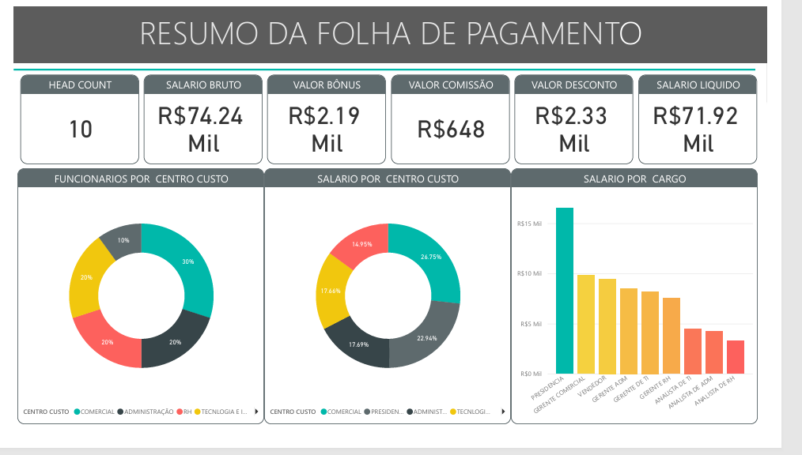
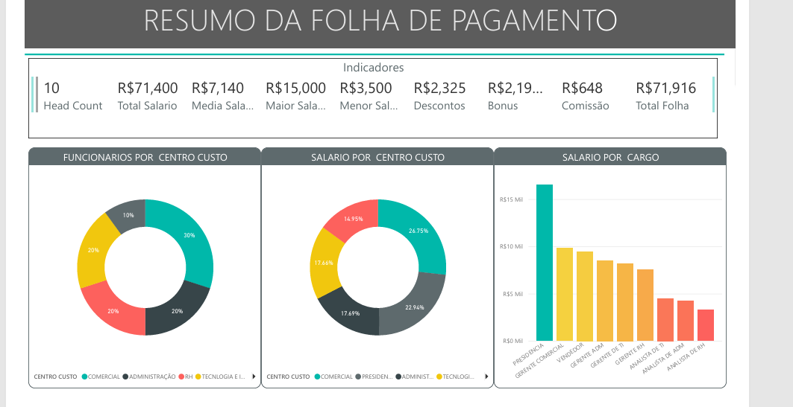
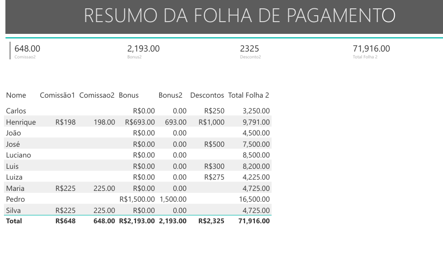

# 📊 Dashboard de Gestão de Folha de Pagamento e RH
Dashboard interativo de Business Intelligence para gestão de RH e Folha de Pagamento, com foco em análise de custos, head count e remuneração variável.

###### Este dashboard foi desenvolvido para fornecer uma visão estratégica e detalhada sobre a folha de pagamento de uma organização, permitindo o monitoramento de custos, head count e a distribuição de salários por diferentes categorias e centros de custo. 

### Imagem do deshboard 
 
 
 

# 📌 Visão Geral
Este dashboard foi desenvolvido para centralizar informações financeiras críticas sobre o capital humano de uma organização. O foco é permitir que gestores identifiquem rapidamente os maiores centros de despesa, analisem a equidade salarial por cargo e monitorem a eficiência na distribuição de bônus e comissões.
Objetivo: Centralizar dados de folha para facilitar a gestão de custos e headcount.
Público-alvo: Gestores de RH, Gerentes Financeiros e Coordenadores de Centro de Custo.
Fonte de Dados: Projeto prático realizado com base em dados de cenários corporativos para gestão de pessoas.

# 📈 Indicadores Chave de Performance (KPIs)
O dashboard destaca métricas essenciais para a gestão de RH:
Head Count: Total de colaboradores ativos na base.
Salário Bruto: Somatório total dos salários antes de descontos.
Valor Bônus e Valor Comissão: Detalhamento da remuneração variável paga aos colaboradores.
Valor Desconto: Total de deduções aplicadas na folha.
Salário Líquido: Valor final desembolsado pela empresa após todos os ajustes.

# 🎨 Apresentação Gráfica e Visualização
Para uma análise intuitiva, foram utilizados os seguintes recursos visuais:
Cards de Resumo: Exibição clara dos valores totais de salários, bônus, comissões e descontos.
Gráficos de Rosca (Donuts): Visualização da distribuição de funcionários e salários por Centro de Custo.
Gráfico de Barras: Comparativo de salários por Cargo, permitindo identificar disparidades ou picos de custo em funções específicas.
Matriz Detalhada: Tabela completa com informações individuais por colaborador, incluindo bônus, comissões e total líquido.
# 💡 Insights
🖼️ Análise de Distribuição e Custos
Visão por Centro de Custo: Gráficos de rosca facilitam a identificação de quais áreas demandam maior investimento.

Análise por Cargo: Gráficos de barras comparativos que revelam disparidades ou picos de custo em funções específicas.

Detalhamento Individual: Matriz detalhada que permite a transição da visão macro (empresa) para a visão micro (colaborador).

# 🛠️ Inteligência de Dados com DAX
Foram criadas diversas medidas personalizadas para garantir a precisão dos cálculos:
Medidas de Soma e Média: Cálculos automáticos para Total Salário, Média Salarial, Maior Salário e Menor Salário.
Cálculos de Remuneração Líquida: Fórmulas DAX para subtrair descontos e somar comissões/bônus ao salário bruto de forma dinâmica.

# ⚙️ Processo de ETL e Modelagem
Tratamento de Dados: Limpeza de dados de folha de pagamento no Power Query para garantir que valores monetários e nomes de cargos estivessem padronizados.
Segmentação por Abas: O projeto foi organizado em diferentes abas (Página 1, Medidas, Iterativas) para facilitar a manutenção e a navegação do usuário.

# 💾 Fonte dos Dados
Projeto realizado como parte do aprendizado prático em inteligência de negócios, focado na aplicação de Power BI para cenários corporativos de gestão de pessoas.  

# ✍️ Autor
### Marcos Lopes Pereira

LinkedIn: [https://www.linkedin.com/in/marcosinada/]

E-mail: marcoscorleone1985@gmail.com

